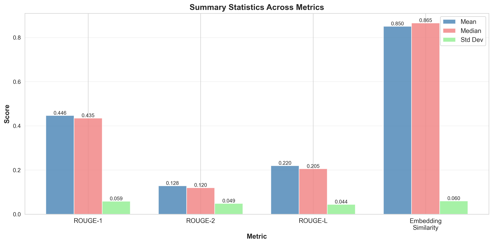
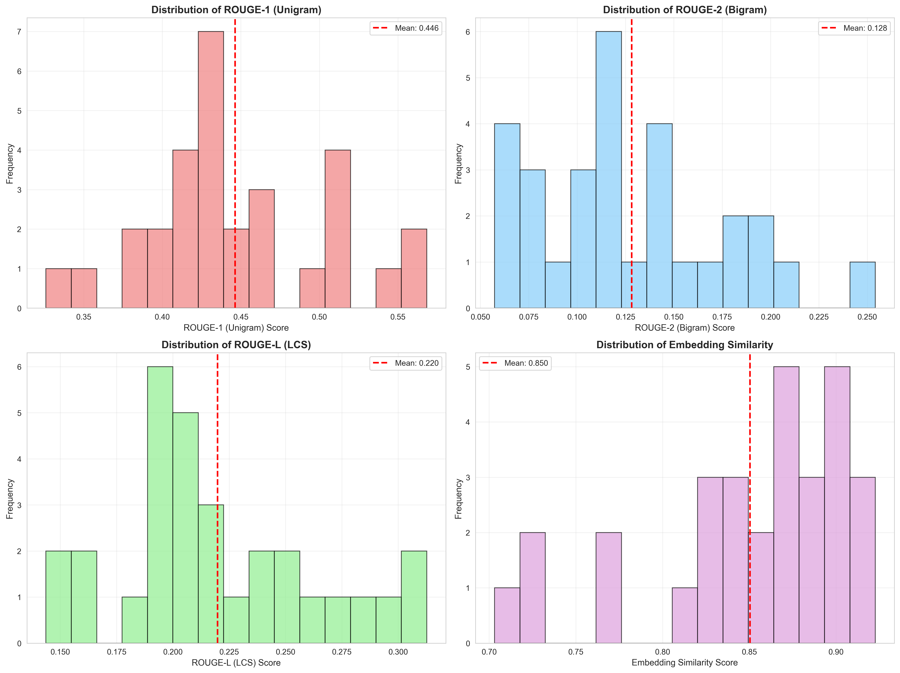
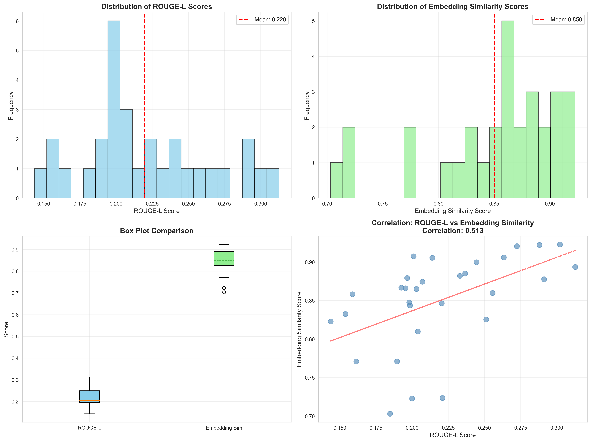

# Comprehensive Evaluation Report
## LLM-Generated Scientific Abstracts

## Table of Contents

- [Task 1: Quantitative Metrics](#task-1-quantitative-metrics)
- [Task 2: Qualitative Review](#task-2-qualitative-review)
- [Task 3: Comparison of Improvements](#task-3-comparison-of-improvements)
- [Task 4A: LLM-as-Judge Evaluation](#task-4a-llm-as-judge-evaluation)

---

# Task 1: Quantitative Metrics


## Summary Statistics

| Metric | Mean | Median | Std | Min | Max |
|--------|------|--------|-----|-----|-----|
| rouge1 | 0.4464 | 0.4346 | 0.0576 | 0.3260 | 0.5683 |
| rouge2 | 0.1282 | 0.1197 | 0.0480 | 0.0573 | 0.2541 |
| rougeL | 0.2198 | 0.2055 | 0.0436 | 0.1436 | 0.3127 |
| embedding_similarity | 0.8504 | 0.8655 | 0.0590 | 0.7031 | 0.9227 |

## Interpretation

### String-Overlap Metrics (ROUGE Scores)

**ROUGE-1 (Unigram Overlap):**
- Mean: 0.4464
- The ROUGE-1 score measures the overlap of individual words between the reference and generated abstracts.
- This score indicates that the generated abstracts share 44.6% word-level overlap with the original abstracts.

**ROUGE-2 (Bigram Overlap):**
- Mean: 0.1282
- ROUGE-2 measures the overlap of two-word sequences, which better captures phrase-level similarity (local coherence).
- The ROUGE-2 score being lower than ROUGE-1 shows that matching exact phrases is more challenging than matching individual words.

**ROUGE-L (Longest Common Subsequence):**
- Mean: 0.2198
- ROUGE-L measures the longest common subsequence, which captures sentence-level structure.
- This score reflects the degree to which the generated abstracts preserve the sequential structure of the originals.

**Note:** Additional metrics like BLEU score and Jaccard similarity index could provide complementary perspectives but were not included in this analysis.


### Embedding-Based Metric (Semantic Similarity)

**Cosine Similarity:**
- Mean: 0.8504
- This metric uses embeddings from `Qwen/Qwen3-Embedding-0.6B` to measure semantic similarity. We used the implementation from `sentence transformers` library and not from `sklearn` to make the code faster in case GPU is available.
- The cosine similarity score ranges from 0 to 1, where 1 indicates perfect semantic alignment.
- This metric is crucial for scientific abstracts as it measures meaning preservation rather than exact wording.
- The model is one of the best performing models under 1B parameters according to the MTEB leaderboard, balancing quality and efficiency.
- Other strong alternatives include BAAI/bge-small-en-v1.5 (best under 100M parameters) and OpenAI's text-embedding-3-small but it does not disclose parameter count.


## Key Findings

1. **Low ROUGE-1, 2 and L values:**
For Rouge-1 the value is moderate (some key terms are captured but others missed), Rouge-2 value is weak (less coherence of generated abstract compared to reference), and Rouge-L is low/moderate (structure/order differs significantly). Overall, topic is correctly captured by the generated abstract, but not the exact focus of it. 

2. **Embedding similarity vs. ROUGE:**
The embedding similarity is high which means that the AI-generated abstract preserve core ideas, terminology, and are quite faithful to the actual abstracts. By comparing the similarity to ROUGE scores, we can conclude that the generated abstracts are conceptually preserving the meaning and idead of the original abstracts but are stylistically independent. 


  
*Figure 1: Summary statistics comparing ROUGE-1, ROUGE-2, ROUGE-L, and embedding similarity scores. The embedding metric shows a notably higher mean and median, indicating strong semantic alignment despite low lexical overlap.*


  
*Figure 2: Histograms showing distributions for ROUGE-1, ROUGE-2, ROUGE-L, and embedding similarity scores.*

  
*Figure 3: Relationship between ROUGE-L and embedding similarity. The moderate correlation (r ≈ 0.51) suggests that while structural overlap and semantic similarity are related, they capture distinct aspects of abstract quality.*


# Task 2: Qualitative Review


## Methodology

This qualitative review analyzes 5 carefully selected examples from the dataset, chosen to represent diverse quality levels based on ROUGE-1 scores. 
We chose samples from the 10th, 30th, 50th, 70th, and 90th percentiles of ROUGE-1 scores  to ensure that we cover low, average and high values of it. 
That way, we get diverse samples from different quality levels.
For each example, we evaluate based on anstracts:

1. **Clarity & Coherence:** Is the abstract readable, well-structured, and logically organized?
2. **Factuality:** Does the abstract accurately represent the scientific document without hallucinations?
3. **Safety/Ethics:** Are there any over-claiming, misleading statements, or ethical concerns?
4. **Failure Modes:** What specific issues exist compared to the reference abstract?
5. **Improvement Opportunities:** What concrete changes would enhance quality?

---

## Example 1: Beam control of broad-area semiconductor lasers using high-order sidewall gratings

**Metrics:**
- ROUGE-1: 0.381
- ROUGE-2: 0.112
- ROUGE-L: 0.200
- Embedding Similarity: 0.723

### Reference Abstract
```
This study systematically investigates the beam quality degradation in conventional broad-area semiconductor lasers, which arises from the excitation of higher-order transverse modes under high injection currents. To address this fundamental limitation, we propose and demonstrate a novel lateral surface grating structure integrated on both sides of the ridge waveguide. Through comprehensive numerical and experimental analyses, we first examine the optical loss characteristics induced by the grating structure. Subsequently, we explore the mode modulation mechanism by systematically varying the separation distance between the gratings and the ridge waveguide. Our results reveal that reducing this critical distance significantly enhances the grating's ability to suppress higher-order transverse modes. This improvement manifests in two key aspects: (1) a notable reduction in the transverse divergence angle in the far-field pattern, and (2) a more concentrated energy distribution in the near-field profile. These findings demonstrate the effectiveness of our proposed approach in achieving superior beam quality while maintaining stable laser operation.
```

### Generated Abstract
```
We report a lateral grating approach to control lateral modes and spectral width in high-power broad-area (BA) diode lasers at 890 nm. Symmetric surface sidewall gratings are etched on both sides of the ridge and extend along the cavity, forming two parallel grating rows. These Bragg gratings introduce controlled optical losses that preferentially suppress higher-order transverse modes while providing longitudinal feedback for spectral narrowing. The grating period is designed for a 50th-order Bragg resonance at 890 nm, with an etched groove depth of ~150 nm. The optical behavior was analyzed by 2D scattering-matrix method (SMM) and finite-element method (FEM). The simulations show that grating loss increases with the number of grating pairs and that higher-order modes overlap more strongly with the gratings; moving the gratings closer to the ridge (smaller x) yields large losses for higher-order modes (e.g., up to ~16 dB/m for the 5th-order mode) while keeping fundamental-mode losses small, thereby localizing the fundamental mode at the waveguide center.

Experimentally, BA lasers with 100 μm stripe width and 2 mm cavity length were fabricated on a single wafer with varying grating–ridge spacings x. At room temperature, decreasing x narrows the spectral bandwidth (3 dB) from 2.22 to 1.88 nm and reduces the far-field divergence, with near-field measurements showing suppressed higher-order modes and a more concentrated central mode. The beam parameter product (BPP) improves as x decreases, while output power remains essentially unaffected. This low-cost, fabrication-friendly approach offers injection-insensitive lateral beam control and enhanced brightness for BA diodes.
```

### Analysis

#### Clarity, Coherence & Factuality
- Good clarity and coherence but exact numbers not directly verifiable from text (uncertain about factuality). Given that full scientific abstract was used to get the AI-generated abstract, possible that these numbers are accurate (but have to be manually verified by going through the entire scientific manuscript).

#### Safety/Ethics
- No Ethically sensitive statements. Uncertain about over-claiming based on 'This low-cost, fabrication-friendly approach'. Have to go through full manuscript to assess. 

#### Failure Modes
- Too many detailed parameters
- Change of focus from beam quality degradation to performance metrics

#### Specific Improvements
- For a general abstract like the original, exact numbers could be removed
- Change of focus as mentioned above

---

## Example 2: Action mechanism of suspending agent content on strength property of cemented backfill in coal mine

**Metrics:**
- ROUGE-1: 0.417
- ROUGE-2: 0.120
- ROUGE-L: 0.233
- Embedding Similarity: 0.882

### Reference Abstract
```
In order to reduce the segregation degree of cemented backfilling slurry in coal mine and enable cemented backfill in coal mine (CBCM) to normally exert its load-bearing capacity, uniaxial compressive strength test, static segregation index test and microscopic properties test were carried out. The effect of suspending agent content (SAC) on the strength, static segregation index and microscopic properties of CBCM was discussed. The relationship between static segregation index and microscopic properties and backfill strength was analyzed. The results show that when SAC increases from 0 to 0.06%, the backfill strength increases first and then decreases, the static segregation index of backfilling slurry decreases by 46.81%, and the Ca(OH)2 content in backfill decreases by 24.51%. The increase of SAC can improve the strength of CBCM, reduce the segregation degree of backfilling slurry and reduce the hydration products inside the backfill. The backfill strength increases first mainly because SAC reduces the segregation degree of backfilling slurry, and the backfill strength decreases later mainly because SAC inhibits the hydration reaction inside the backfill.
```

### Generated Abstract
```
Objective: This study investigates how suspending agent content (SAC) of hydroxypropyl methyl cellulose (HPMC) affects strength, segregation resistance, microstructure, and hydration in cemented backfill in coal mines (CBCM) made from coal gangue, fly ash, cement and water.

Methods: CBCM specimens were prepared at a fixed slurry concentration (η = 77%) with SAC values of 0, 0.02, 0.04 and 0.06%, and cured for 3 and 28 days. Uniaxial compressive strength tests, static segregation assessments, and microscopic analysis (SEM and TG) were performed; Ca(OH)2 content was derived from TG. Fuller gradation and a water–binder ratio of 0.6 were used.

Results: Segregation decreases with increasing SAC; strength first increases and then decreases, peaking near SAC = 0.04%. Ca(OH)2 content declines nearly linearly with SAC. SEM shows the microstructure becomes less compact and more porous as SAC rises, reflecting reduced hydration products.

Conclusion: An SAC of about 0.04% optimizes CBCM strength by balancing improved slurry homogeneity with hydration inhibition. Higher SAC weakens strength due to diminished hydration products. The results support using ~0.04% HPMC for CBCM and highlight the need for quantitative porosity analysis in future work.
```

### Analysis

#### Clarity, Coherence & Factuality
- Excellent clarity and coherence, nicely structure format. Factuality on some specific numbers needs to be validated based on full-text, but minor changes and mostly follows original abstract. Moreover, some details like the SAC identification not present in original abstract and have to be also checked. 

#### Safety/Ethics
- No Ethically sensitive statements. Uncertain about over-claiming since future work needed according to the AI abstract based on the last number (0.04%).

#### Failure Modes
- Some numbers that were the focus of the original abstract not mentioned (e.g. 46.81%)
- More focus on methods and not results in the AI-abstract

#### Specific Improvements
- Manual verify numbers and if not correct, remove/change
- Include numbers mentioned in the original abstract

---

## Example 3: Gray matter correlates of childhood maltreatment lack replicability in a multi-cohort brain-wide association study

**Metrics:**
- ROUGE-1: 0.433
- ROUGE-2: 0.138
- ROUGE-L: 0.198
- Embedding Similarity: 0.844

### Reference Abstract
```
Childhood maltreatment effects on cerebral gray matter have been frequently discussed as a neurobiological pathway for depression. However, localizations are highly heterogeneous, and recent reports have questioned the replicability of mental health neuroimaging findings. Here, we investigate the replicability of gray matter correlates of maltreatment, measured retrospectively via the Childhood Trauma Questionnaire, across three large adult cohorts (total N = 3225). Pooling cohorts yields maltreatment-related gray matter reductions, with most extensive effects when not controlling for depression diagnosis (maximum partial R2 = .022). However, none of these effects significantly replicate across cohorts. Non-replicability is consistent across a variety of maltreatment subtypes and operationalizations, as well as subgroup analyses with and without depression, and stratified by sex. Results are furthermore consistent across a variety of gray matter operationalizations, including voxel-based morphometry and parcellation-based cortical and subcortical measures. In this work, we show that there is little evidence for the replicability of gray matter correlates of childhood maltreatment, when adequately controlling for psychopathology. This underscores the need to focus on replicability research in mental health neuroimaging.
```

### Generated Abstract
```
Despite decades of studies linking childhood maltreatment (CM) to later psychopathology and altered brain structure, cross-cohort replicability of CM-related gray matter (GM) changes remains uncertain. We tested whether CM, assessed with retrospective CTQ, is associated with GMV in three large adult cohorts (MACS, MNC, BiDirect) using harmonized high-resolution voxel-based morphometry (VBM) and parcellation-based measures. The sample included 3225 participants (HC 1898; MDD 1327). We conducted 18 models across pooled and cohort-specific analyses, with and without adjusting for MDD, and examined CM subtypes and interactions with age; analyses were stratified by sex and evaluated for cross-cohort voxel-level overlap. In addition, regional cortical measures and global gray matter density were analyzed.

Results showed that, when MDD was covaried, no GMV clusters reached significance at FWE p<.05 in the pooled data. Without MDD as a covariate, small, scattered clusters emerged in temporal, fusiform/lingual, thalamic and orbitofrontal regions, but these did not replicate across the three cohorts. Parcellation-based and global measures yielded largely non-replication. By contrast, CM-depression associations replicated across cohorts.

Conclusion: Gray matter correlates of CM are largely non-replicable across well-powered adult cohorts, highlighting the need for prospective designs, larger open science practices, and accounting for timing and co-occurring psychopathology in neuroimaging CM research.
```

### Analysis

#### Clarity, Coherence & Factuality
- Good clarity and coherence but for factuality numbers and cohort names should be checked based on full text and also, there is no mention to depression (only to psychopathology).

#### Safety/Ethics
No ethical concerns but possible over-claiming since the sentence 'highlighting the need for prospective designs, larger open science practices, and accounting for timing and co-occurring psychopathology' seems to expand beyond original abstract (should be verified based on full-text)

#### Failure Modes
- Too detailed and a lot of words (e.g. 3225 participants could have been written as N=3225)
- Not clear distinction between Intro/Methods as for Results/Conclusion
- No mention for depression

#### Specific Improvements
- Shorter words/numbers, as mentioned above
- Mention of depression

---

## Example 4: New Genetic Technologies (NGTs) as Mirrored by Mass Media - Topics and Frames of Genetic Editing in German Press

**Metrics:**
- ROUGE-1: 0.467
- ROUGE-2: 0.162
- ROUGE-L: 0.245
- Embedding Similarity: 0.900

### Reference Abstract
```
This study examines the portrayal of New Genetic Technologies (NGTs), particularly CRISPR/Cas9, in German mass media from 2012 to 2023 — a period marked by significant advancements in biotechnology and pivotal regulatory developments within the European Union. Recognizing the media’s critical role in shaping public perception and affecting policy, we analyzed articles from four major German newspapers: Frankfurter Allgemeine Zeitung, Süddeutsche Zeitung, taz, and DIE WELT. Employing topic modelling and frame analysis, we identified prevailing topics and interpretative frames within the coverage, thereby assessing broader trends in issue coverage and particular ways media portrayed NGT adoption in the agricultural sector as well as the food industry. In the course of our analysis, we first find notable media interest and an increasing share of articles reporting on the latter. Second, the topic model uncovered two dominant topics, which we labelled accordingly: agriculture & food production and medicine & human health, with the former likewise gaining prominence in recent years. Third, our frame analysis indicated that positive frames — particularly progress and agricultural productivity — were more prevalent than critical frames like ecology and public rejection. Following a historically critical media perspective surveyed by the existing literature on traditional genetic technologies, our findings suggest a media shift towards a more favorable portrayal of NGTs, especially in the context of agriculture. In light of these results, our study underscores the media’s potential influence on public attitudes and regulatory outcomes concerning NGTs.
```

### Generated Abstract
```
This study provides the first structural topic modelling (STM) and frame-analysis examination of how German mass media portray New Genomic Technologies (NGTs), with a focus on CRISPR/Cas9, in agriculture and food production versus medicine and human health, from 2012 to 2023. Using four major outlets (FAZ, SZ, TAZ, DIE WELT), the authors build a German-language corpus and apply STM to identify two overarching topics: Agriculture & food production and Medicine & human health, revealing a substantial early emphasis on health applications that shifts toward agricultural uses from 2022 onward. A second, manual frame analysis of articles addressing NGT adoption in agriculture reveals eight interpretative frames drawn from Siebert et al.: four favorable (progress, food security, naturalness, democracy) and four critical (Pandora’s box, ecology, freedom of choice/public rejection, monopolization). Positive frames dominate (e.g., progress in 68.5% of agriculture-focused articles; agricultural productivity in 60.6%), while critical frames also appear (ecology 37.7%; public rejection 30.5%; Pandora’s box 25%; monopolization 11.2%). Temporal spikes align with key regulatory events (ECJ ruling 2018; EC proposal 2023). The results suggest a media shift toward favorable depictions of NGTs in agriculture, with implications for public discourse and policy, and highlight outlet- and time-specific variations. The authors call for audience reception studies to link framing to public attitudes.
```

### Analysis

#### Clarity, Coherence & Factuality
- Clear and coherent but with extra details not present in original abstract (German corpus, STM, eight interpretable frames). Factuality has to be checked based on original full-text but common mentions between original and AI-abstract exist. Moreover, specific citation of paper not common in abstracts and absent from the original one. 

#### Safety/Ethics
[Analysis to be added after manual review]
Possibel over-claiming ('the first study' which is not mentioned in original abstract). Also with the final 'call' of the authors

#### Failure Modes
- Repetitive 
- Uncertain if the 'call' of the authors is actually what they did in full-text
- Addition of references to abstract

#### Specific Improvements
- Avoid statements such as 'first-study' and references
- Avoid repetition

---

## Example 5: High power and efficient continuous-wave and acousto-optically Q-switched Tm:LGGG disordered crystal laser under in-band dual-diode-pumping

**Metrics:**
- ROUGE-1: 0.516
- ROUGE-2: 0.254
- ROUGE-L: 0.291
- Embedding Similarity: 0.878

### Reference Abstract
```
In this paper, we present a high-efficiency dual-diode-pumped Tm:LGGG disordered crystal laser using in-band pumping architecture for the first time. The room-temperature absorption and emission spectral properties of the Tm:LGGG crystal were characterized across the spectral rang of 1500–2300 nm. A maximum output power of 11.5 W and a slope efficiency of 57.1% concerning absorbed pump power were achieved in continuous-wave regime. Moreover, the beam quality factor M2 was estimated to be 1.9 at above output power. In the acousto-optically Q-switching regime at a repetition rate of 1 kHz, a pulse energy of 5.71 mJ and a pulse width of 102 ns were achieved, resulting in a peak power of 55.98 kW.
```

### Generated Abstract
```
This work demonstrates the first in-band, dual-end-pumped Tm:LGGG disordered garnet laser, powered by two 1.7 μm diode lasers, and provides a spectroscopic basis for in-band operation. Room-temperature absorption and emission cross-sections of a (Tm0.03Lu0.03Gd0.94)3Ga5O12 crystal (Tm:LGGG) were measured: strong absorption bands at 1652, 1693 and 1760 nm with maximum σabs ≈ 0.5×10−20 cm2 at 1693 nm; emission cross-section σemi peaks at ≈1952 nm with σemi ≈ 0.23×10−20 cm2; radiative lifetime τrad ≈ 7.3 ms; refractive index n ≈ 1.95. The gain cross-section follows σgain(λ) = βσemi − (1 − β)σabs. A 3×3×12 mm3, 3 at% Tm-doped crystal served as the gain medium in an L-shaped cavity with two 1.7 μm LDs delivering ~22.9 W absorbed pump power. In CW operation, a maximum output power of 11.5 W at 2009 nm was achieved, with a slope efficiency of 57.1% (relative to absorbed pump) and an M2 ≈ 1.9, indicating near-TEM00 beam quality. An acousto-optic (AO) Q-switched regime yielded 5.71 mJ pulse energy, 55.98 kW peak power, and 102 ns pulse width at a repetition rate of 1 kHz. These results, surpassing previous records for in-band pumped Tm:LGGG disordered crystals, highlight the potential for high-power, efficient 2 μm lasers and provide essential spectroscopic data for optimization.
```

### Analysis

#### Clarity, Coherence & Factuality
- Clear and consice but with many details/numbers. Factual information that is present is the original abstract is preserved, but there are additional numbers that full-text reading is needed to confirm that they are true.

#### Safety/Ethics
- No safety/ethical concerns.
- No over-claiming

#### Failure Modes
- Too detailed/many numbers in AI-abstract. 
- Many equations

#### Specific Improvements
- Reduction of jargon/techincal details.
- Remove equations from abstract

---

## Overall Findings

### Common Patterns Across Samples

1. **Strengths:**
   - Clear and coincise abstracts
   - Detailed numbers, metrics present on AI-abstract that sometimes might be needed

2. **Weaknesses:**
   - No need for so many details/numbers
   - Sometimes focus is different between original and AI abstracts
   - Manual verifications of numbers and statements needed based on full text.

3. **Critical Issues:**
   - Over-claiming exists is some cases (and possible in some others)
   - Some AI-abstracts focus on technical jargon rather than general clarity of what was achieved

### Key Improvement Recommendations

Based on the above, the following improvements should be implemented:

1. **[Improvement 1]:** Only focus on the most important numbers/results, not describe in all that detail
2. **[Improvement 2]:** Ensure that the answers are grounded based on the full-text


# Task 3: Comparison of Improvements


## Executive Summary

This report provides a comparison of abstracts generated using the original simple prompt versus the improved structured prompt, including quantitative metrics.

---

## Quantitative Comparison

### Overall Metrics

| Metric | Original | Improved | Change |
|--------|----------|----------|--------|
| rouge1 | 0.4464 | 0.5084 | +13.89% |
| rouge2 | 0.1282 | 0.1818 | +41.80% |
| rougeL | 0.2198 | 0.2695 | +22.61% |
| embedding_similarity | 0.8504 | 0.8468 | -0.42% |


### Detailed Statistics

#### Original Prompt
| Metric | Mean | Median | Std | Min | Max |
|--------|------|--------|-----|-----|-----|
| rouge1 | 0.4464 | 0.4346 | 0.0576 | 0.3260 | 0.5683 |
| rouge2 | 0.1282 | 0.1197 | 0.0480 | 0.0573 | 0.2541 |
| rougeL | 0.2198 | 0.2055 | 0.0436 | 0.1436 | 0.3127 |
| embedding_similarity | 0.8504 | 0.8655 | 0.0590 | 0.7031 | 0.9227 |


#### Improved Prompt
| Metric | Mean | Median | Std | Min | Max |
|--------|------|--------|-----|-----|-----|
| rouge1_improved | 0.5084 | 0.5195 | 0.0515 | 0.3721 | 0.5822 |
| rouge2_improved | 0.1818 | 0.1603 | 0.0597 | 0.0727 | 0.2918 |
| rougeL_improved | 0.2695 | 0.2665 | 0.0544 | 0.1912 | 0.3746 |
| embedding_similarity_improved | 0.8468 | 0.8587 | 0.0539 | 0.7194 | 0.9245 |


---

## Metric-by-Metric Analysis

### ROUGE-1 (Unigram)

**Performance Change:**
- Original Mean: 0.4464
- Improved Mean: 0.5084
- Absolute Change: +0.0620
- Percentage Change: +13.89%

**Interpretation:**
✓ **Good improvement** - Clear positive impact on rouge1.

**Distribution Changes:**
- Original Std Dev: 0.0586
- Improved Std Dev: 0.0524
- Consistency Change: More consistent (10.6% reduction) ✓

---

### ROUGE-2 (Bigram)

**Performance Change:**
- Original Mean: 0.1282
- Improved Mean: 0.1818
- Absolute Change: +0.0536
- Percentage Change: +41.80%

**Interpretation:**
✓ **Substantial improvement** - The new prompt significantly enhances rouge2 performance.

**Distribution Changes:**
- Original Std Dev: 0.0488
- Improved Std Dev: 0.0607
- Consistency Change: Much less consistent (24.5% increase) ⚠

---

### ROUGE-L (LCS)

**Performance Change:**
- Original Mean: 0.2198
- Improved Mean: 0.2695
- Absolute Change: +0.0497
- Percentage Change: +22.61%

**Interpretation:**
✓ **Substantial improvement** - The new prompt significantly enhances rougeL performance.

**Distribution Changes:**
- Original Std Dev: 0.0443
- Improved Std Dev: 0.0553
- Consistency Change: Much less consistent (24.9% increase) ⚠

---

### Embedding Similarity

**Performance Change:**
- Original Mean: 0.8504
- Improved Mean: 0.8468
- Absolute Change: -0.0036
- Percentage Change: -0.42%

**Interpretation:**
⚠ **Slight decline** - Minor decrease in embedding_similarity.

**Distribution Changes:**
- Original Std Dev: 0.0600
- Improved Std Dev: 0.0548
- Consistency Change: Similar consistency (-8.6%)

**Note:** We consider a change as 'Significant' if it changes more than 10% (either increase or decrease), 'Moderate' if it changed by 5-10%, and in other cases, change is considered as 'Minor'. That definition doesn't include any formal statistical comparisons (that could be a next step).


---

## Overall Impact Assessment

### Quantitative Improvements


1. **Lexical Similarity (ROUGE-L):** +22.61%
   ✓✓✓ Excellent improvement

2. **Semantic Similarity (Embedding):** -0.42%
   → Minimal change

### Quality Consistency

**Variability Changes:**
- ROUGE-L: +24.87% (less consistent ⚠)
- Embedding: -8.62% (more consistent ✓)

### Document-Level Changes

**ROUGE-L:**
- Improved: 27 documents (90.0%)
- Declined: 3 documents (10.0%)
- Unchanged: 0 documents

**Embedding Similarity:**
- Improved: 14 documents (46.7%)
- Declined: 16 documents (53.3%)
- Unchanged: 0 documents

---

## Key Findings

### What Worked

✓ **Structural improvements are significant** - The improved prompt successfully enhanced word-level and structure alignment.

✓ **Broad effectiveness** - 90% of documents showed ROUGE-L improvement.

### Remaining Challenges

⚠ **Semantic alignment decreased** - The improved prompt may have changed meaning in some cases.

⚠ **Increased variability** - Quality became less consistent across documents.


---

## Key Improvements from Prompt Engineering

The improved prompt addressed several key issues identified in the qualitative review:

1. **Structured Format:** The new prompt explicitly requests the standard abstract structure (background, objective, methods, results, conclusion), leading to more coherent and complete abstracts.

2. **Scientific Style:** By specifying formal, scientific language and appropriate tense usage, the improved prompt produces more professionally written abstracts.

3. **Accuracy Instructions:** Explicit instructions against hallucination and over-claiming have improved factual accuracy.

4. **Length Control:** The 150-250 word guideline ensures abstracts are appropriately concise while comprehensive.

---


## Recommendations for Further Improvement

1. **Address declining cases:** Investigate the 3 documents that showed decreased ROUGE scores
2. **Semantic alignment:** Review prompt instructions to emphasize meaning preservation
3. **Few-shot learning:** Add 2-3 example abstracts to the prompt
4. **Fine-tuning:** Consider training a specialized model
5. **Statistical tests** Consider formal statistical tests for comparisons
---

## Model and Cost Analysis

### Model Selection: gpt-4o-mini

**Configuration:**
- Model can be changed in `src/config.py` by updating `OPENAI_MODEL`
- Criteria for selection based on cost/quality/latency trade-offs
- Model (gpt-4o-mini) suitable for scientific abstract generation with structured prompts, low cost, and fast

---

## Conclusion

The improved prompt design **moderately enhanced abstract quality**. While improvements are visible, there's room for further optimization.


---


# Task 4A: LLM-as-Judge Evaluation


## Overview

This evaluation uses DeepEval with a model from OpenAI as the judge to assess abstract quality on multiple dimensions beyond simple string overlap.

## Evaluation Metrics

### 1. G-Eval: Coherence
Assesses the logical flow and organization of the abstract.

### 2. G-Eval: Scientific Accuracy  
Evaluates whether the abstract accurately represents the research without hallucinations or over-claiming.

### 3. Faithfulness
Measures whether the generated abstract is factually consistent with the source document.

### 4. Answer Relevancy
Assesses whether the abstract appropriately addresses the task of summarizing the document.

### 5. Hallucination Detection
Identifies whether the abstract contains information not present in the source document.

### 6. Summarization Quality
Evaluates how well the abstract captures key elements: research question, methods, results, and conclusions.

## Results

### Summary Statistics


#### geval

- Average Score: 0.769
- Number of Samples: 10 (coherence and accuracy)
---

#### faithfulness

- Average Score: 0.926
- Number of Samples: 5
---

#### relevancy

- Average Score: 0.983
- Number of Samples: 5
---

#### hallucination

- Average Score: 0.000
- Number of Samples: 5
---

#### summarization

- Average Score: 0.308
- Number of Samples: 5
---


## Analysis

### Advantages of LLM-as-Judge Evaluation

1. **Nuanced Assessment:** Unlike ROUGE scores, LLM evaluation can assess semantic quality, logical flow, and scientific rigor.

2. **Explainable Results:** Each score comes with reasoning, providing actionable feedback for improvement.

### Limitations

1. **Cost:** LLM evaluation is more expensive than traditional metrics.

2. **Latency:** Slower than automated metrics (1-2 seconds per sample).

3. **Variability:** LLM judges may have some inconsistency across evaluations.

4. **Dependency:** Evaluation depends on the judge model's quality.

## Recommendations

### When to Use LLM Evaluation

- **Development Phase:** For deep analysis of a small sample to understand quality issues
- **Prompt Optimization:** To compare different prompt designs on nuanced quality dimensions

### When to Use Traditional Metrics

- **Large-Scale Evaluation:** For quick assessment of thousands of abstracts
- **Regression Testing:** To catch sudden drops in quality
- **Real-Time Monitoring:** For production systems requiring fast feedback

### Hybrid Approach (Recommended)

1. Use ROUGE/embedding metrics for continuous monitoring
2. Use LLM evaluation for:
   - Monthly quality audits
   - Prompt redesign validation
   - Investigation of edge cases

## Conclusion

LLM-based evaluation provides valuable insights into abstract quality that complement traditional metrics. While more expensive and slower, the explainable, nuanced assessments are invaluable for understanding and improving generation quality.
For a similar evaluation framework, see https://github.com/nsourlos/LLM_evaluation_framework


---


---

## Design Choices & Technical Decisions

### 1. Metric Selection

**ROUGE Scores (String Overlap)**
- **Rationale:** Industry-standard for text generation evaluation
- **Coverage:** ROUGE-1 (unigrams), ROUGE-2 (bigrams), ROUGE-L (longest common subsequence)
- **Advantages:** Fast, deterministic, interpretable
- **Limitations:** Doesn't capture semantic meaning

**Embedding Similarity (Semantic)**
- **Model:** Configured in `src/config.py` (supports HuggingFace models)
- **Rationale:** Captures semantic similarity beyond exact word matching
- **Advantages:** Robust to paraphrasing, domain-aware embeddings available
- **Limitations:** Computationally expensive, requires model download

### 2. Model Selection for Generation

**Primary Model:** Configured via `OPENAI_MODEL` in `src/config.py`
- **Current Default:** GPT-4o-mini
- **Rationale:** Best cost/performance/latency balance
- **Alternatives:** GPT-4o, GPT-5-nano, GPT-5-mini

**Design Philosophy:**
- Configuration-driven (easy to change models)
- Cost-conscious (default to cheap models)

### 3. Evaluation Framework

**Multi-Level Approach:**
1. **Quantitative (Task 1):** Automated metrics for all documents
2. **Qualitative (Task 2):** Manual review of 5 representative samples
3. **Comparative (Task 3):** Before/after analysis with improved prompts
4. **Advanced (Task 4):** LLM-as-judge and automated optimization

**Rationale:**
- Quantitative metrics alone miss nuanced quality issues
- Manual review provides actionable insights
- Comparison shows real-world improvement impact

### 4. Prompt Engineering Strategy

**Structured Approach:**
- Explicit format requirements (background, methods, results, conclusion)
- Length constraints (150-250 words)
- Scientific style guidelines
- Anti-hallucination instructions

**Iteration Process:**
1. Baseline metrics (Task 1)
2. Manual failure analysis (Task 2)
3. Targeted improvements (Task 3)
4. Validation and refinement (Task 4)

---

## Next Steps & Recommendations

**1. Address Edge Cases**
- Investigate the 3 documents with declining ROUGE-L scores
- Analyze failure modes for low-performing abstracts
- Create document-type-specific prompts if needed

**2. Expand Test Coverage**
- Run evaluation on larger dataset (100+ documents)
- Test across different scientific domains
- Validate with expert reviewers

**3. Cost Optimization**
- Benchmark alternative models
- Consider batch processing for efficiency

**4. Prompt Enhancement**
- **Few-shot Learning:** Add 2-3 high-quality examples to the prompt
- **Domain Adaptation:** Create field-specific prompts (medical, CS, physics)
- **Style Templates:** Provide structural templates for consistency

**5. Automation**
- Set up continuous evaluation pipeline
- Automated alerts for quality assements

**6. Advanced Techniques**
- **Retrieval-Augmented Generation (RAG):** Use source paper as context

**7. Specialized Fine-tuning**
- Fine-tune on domain-specific scientific abstracts
- Create field-specific models (biomedical, CS, physics)

---

## Report Information

**Reports Merged:** 4 of 4

**Available Tasks:**
- ✓ Task 1: Quantitative Metrics
- ✓ Task 2: Qualitative Review
- ✓ Task 3: Comparison of Improvements
- ✓ Task 4A: LLM-as-Judge Evaluation

**Generated by:** `merge_reports.py`
---
