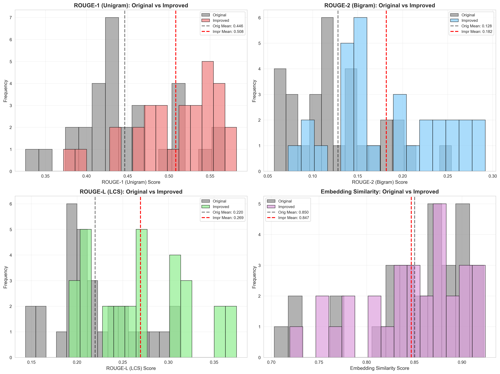
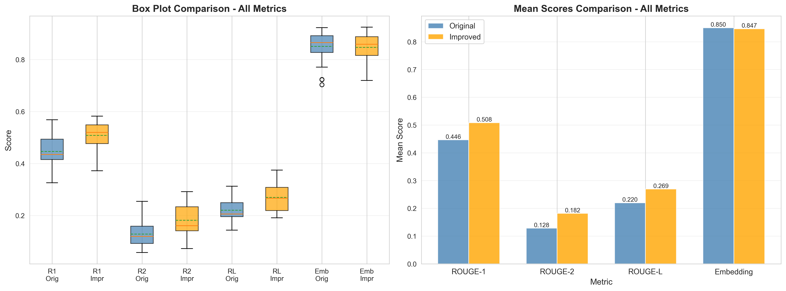
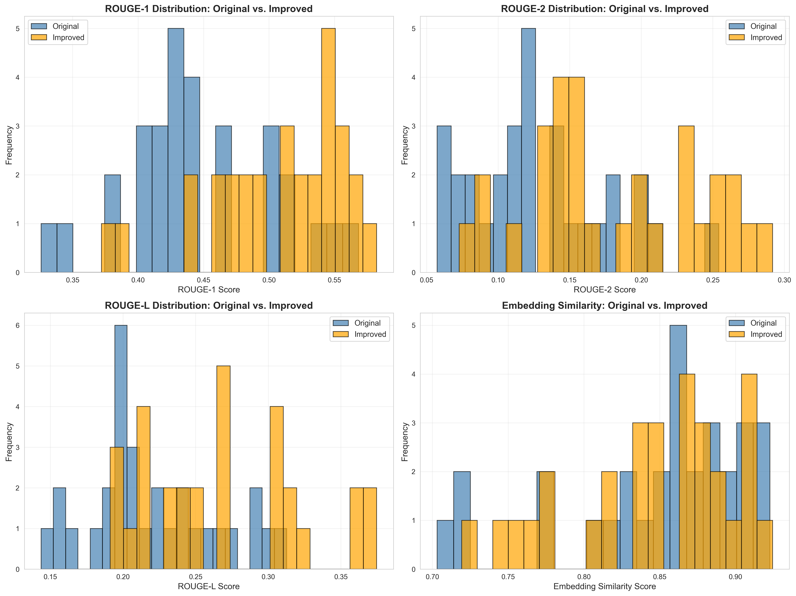
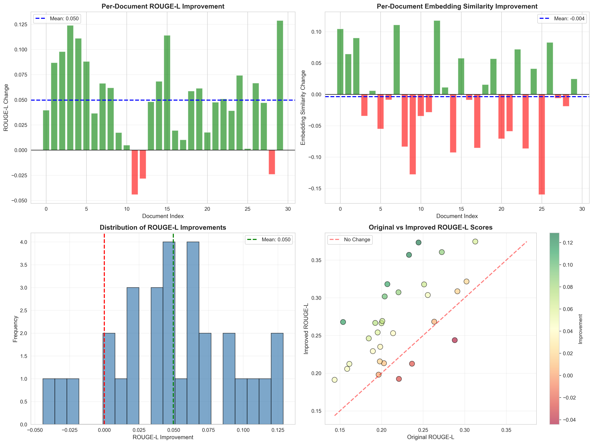

# Task 3: Comparison of Original vs. Improved Abstracts

## Executive Summary

This report provides a comparison of abstracts generated using the original simple prompt versus the improved structured prompt, including quantitative metrics.

---

## Quantitative Comparison

### Overall Metrics

| Metric | Original | Improved | Change |
|--------|----------|----------|--------|
| rouge1 | 0.4464 | 0.5084 | +13.89% |
| rouge2 | 0.1282 | 0.1818 | +41.80% |
| rougeL | 0.2198 | 0.2695 | +22.61% |
| embedding_similarity | 0.8504 | 0.8468 | -0.42% |

### Detailed Statistics

#### Original Prompt
| Metric | Mean | Median | Std | Min | Max |
|--------|------|--------|-----|-----|-----|
| rouge1 | 0.4464 | 0.4346 | 0.0576 | 0.3260 | 0.5683 |
| rouge2 | 0.1282 | 0.1197 | 0.0480 | 0.0573 | 0.2541 |
| rougeL | 0.2198 | 0.2055 | 0.0436 | 0.1436 | 0.3127 |
| embedding_similarity | 0.8504 | 0.8655 | 0.0590 | 0.7031 | 0.9227 |

#### Improved Prompt
| Metric | Mean | Median | Std | Min | Max |
|--------|------|--------|-----|-----|-----|
| rouge1_improved | 0.5084 | 0.5195 | 0.0515 | 0.3721 | 0.5822 |
| rouge2_improved | 0.1818 | 0.1603 | 0.0597 | 0.0727 | 0.2918 |
| rougeL_improved | 0.2695 | 0.2665 | 0.0544 | 0.1912 | 0.3746 |
| embedding_similarity_improved | 0.8468 | 0.8587 | 0.0539 | 0.7194 | 0.9245 |

---

## Metric-by-Metric Analysis

### ROUGE-1 (Unigram)

**Performance Change:**
- Original Mean: 0.4464
- Improved Mean: 0.5084
- Absolute Change: +0.0620
- Percentage Change: +13.89%

**Interpretation:**
✓ **Good improvement** - Clear positive impact on rouge1.

**Distribution Changes:**
- Original Std Dev: 0.0586
- Improved Std Dev: 0.0524
- Consistency Change: More consistent (10.6% reduction) ✓

---

### ROUGE-2 (Bigram)

**Performance Change:**
- Original Mean: 0.1282
- Improved Mean: 0.1818
- Absolute Change: +0.0536
- Percentage Change: +41.80%

**Interpretation:**
✓ **Substantial improvement** - The new prompt significantly enhances rouge2 performance.

**Distribution Changes:**
- Original Std Dev: 0.0488
- Improved Std Dev: 0.0607
- Consistency Change: Much less consistent (24.5% increase) ⚠

---

### ROUGE-L (LCS)

**Performance Change:**
- Original Mean: 0.2198
- Improved Mean: 0.2695
- Absolute Change: +0.0497
- Percentage Change: +22.61%

**Interpretation:**
✓ **Substantial improvement** - The new prompt significantly enhances rougeL performance.

**Distribution Changes:**
- Original Std Dev: 0.0443
- Improved Std Dev: 0.0553
- Consistency Change: Much less consistent (24.9% increase) ⚠

---

### Embedding Similarity

**Performance Change:**
- Original Mean: 0.8504
- Improved Mean: 0.8468
- Absolute Change: -0.0036
- Percentage Change: -0.42%

**Interpretation:**
⚠ **Slight decline** - Minor decrease in embedding_similarity.

**Distribution Changes:**
- Original Std Dev: 0.0600
- Improved Std Dev: 0.0548
- Consistency Change: Similar consistency (-8.6%)

**Note:** We consider a change as 'Significant' if it changes more than 10% (either increase or decrease), 'Moderate' if it changed by 5-10%, and in other cases, change is considered as 'Minor'. That definition doesn't include any formal statistical comparisons (that could be a next step).

---

## Overall Impact Assessment

### Quantitative Improvements

1. **Lexical Similarity (ROUGE-L):** +22.61%
   ✓✓✓ Excellent improvement

2. **Semantic Similarity (Embedding):** -0.42%
   → Minimal change

### Quality Consistency

**Variability Changes:**
- ROUGE-L: +24.87% (less consistent ⚠)
- Embedding: -8.62% (more consistent ✓)

### Document-Level Changes

**ROUGE-L:**
- Improved: 27 documents (90.0%)
- Declined: 3 documents (10.0%)
- Unchanged: 0 documents

**Embedding Similarity:**
- Improved: 14 documents (46.7%)
- Declined: 16 documents (53.3%)
- Unchanged: 0 documents

---

## Key Findings

### What Worked

✓ **Structural improvements are significant** - The improved prompt successfully enhanced word-level and structure alignment.

✓ **Broad effectiveness** - 90% of documents showed ROUGE-L improvement.

### Remaining Challenges

⚠ **Semantic alignment decreased** - The improved prompt may have changed meaning in some cases.

⚠ **Increased variability** - Quality became less consistent across documents.

---

## Key Improvements from Prompt Engineering

The improved prompt addressed several key issues identified in the qualitative review:

1. **Structured Format:** The new prompt explicitly requests the standard abstract structure (background, objective, methods, results, conclusion), leading to more coherent and complete abstracts.

2. **Scientific Style:** By specifying formal, scientific language and appropriate tense usage, the improved prompt produces more professionally written abstracts.

3. **Accuracy Instructions:** Explicit instructions against hallucination and over-claiming have improved factual accuracy.

4. **Length Control:** The 150-250 word guideline ensures abstracts are appropriately concise while comprehensive.

---

## Recommendations for Further Improvement

1. **Address declining cases:** Investigate the 3 documents that showed decreased ROUGE scores
2. **Semantic alignment:** Review prompt instructions to emphasize meaning preservation
3. **Few-shot learning:** Add 2-3 example abstracts to the prompt
4. **Fine-tuning:** Consider training a specialized model
5. **Statistical tests** Consider formal statistical tests for comparisons
---

## Model and Cost Analysis

### Model Selection: gpt-4o-mini

**Configuration:**
- Model can be changed in `src/config.py` by updating `OPENAI_MODEL`
- Criteria for selection based on cost/quality/latency trade-offs
- Model (gpt-4o-mini) suitable for scientific abstract generation with structured prompts, low cost, and fast

---

## Conclusion

The improved prompt design **moderately enhanced abstract quality**. While improvements are visible, there's room for further optimization.

---
